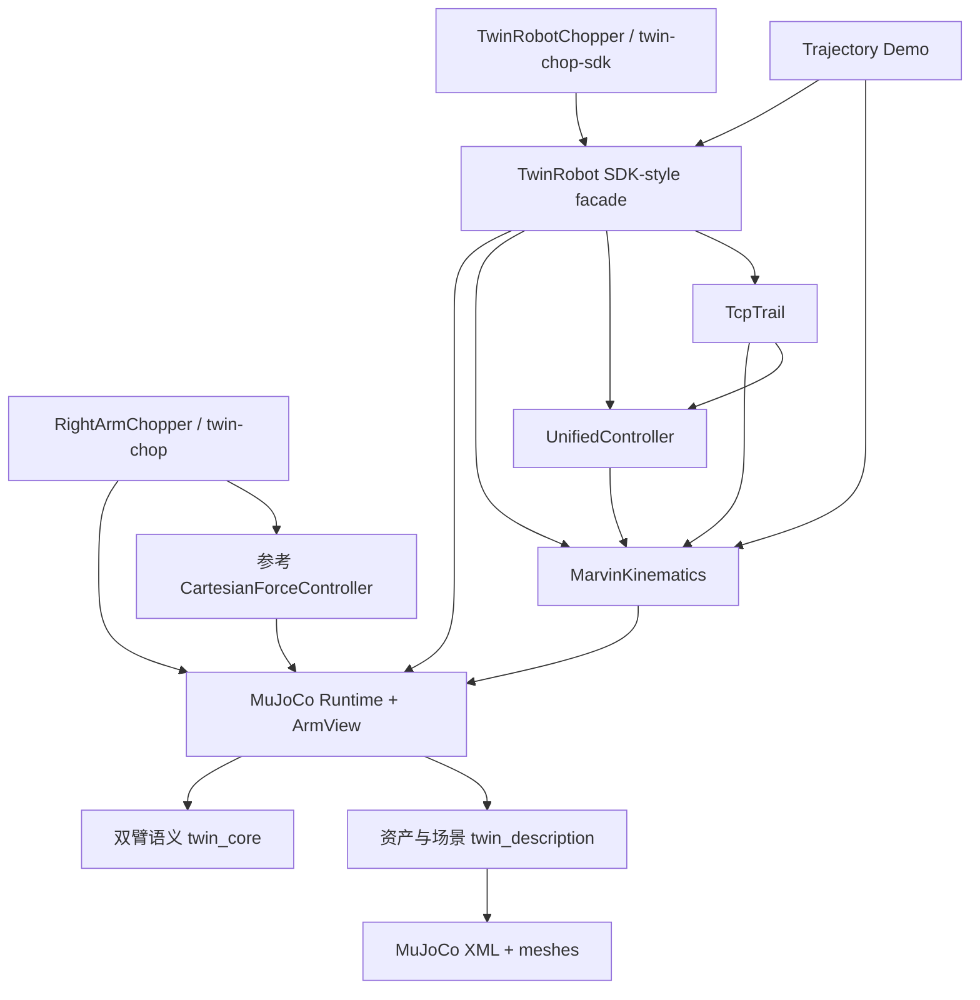
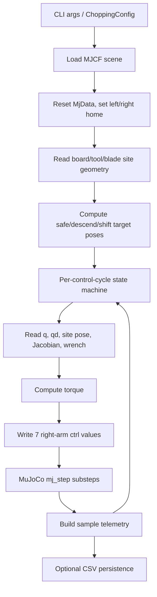

# tianji_robotic_project Architecture

本文档是 `tianji_robotic_project` 的长期架构文档。它按系统行为和模块职责描述项目，而不是按目录罗列文件。后续修改运行时、控制器、场景资产或 CLI 时，应同步更新本文档。

## 1. 项目整体目标

本项目要解决的问题是：在不依赖真实机器人和 ROS2 的前提下，用纯 Python + MuJoCo 搭建 Marvin CCS 双臂机器人仿真工作区，并验证右臂切菜、轨迹执行、力/阻抗控制等核心能力。当前阶段的目标是“phase one pure MuJoCo”：所有控制、运动学、状态机、日志和可视化都在本地仿真中完成。

系统整体架构是四层：

1. **机器人语义层**：定义 left/right 两个 7-DoF arm 的关节名、执行器名、轨迹输入校验等后端无关概念。
2. **资产与场景层**：提供 Marvin CCS 源模型和右臂切菜 MJCF 场景路径；场景内固定关键对象名、传感器、刀具、砧板和 tool/site frame 约定。
3. **MuJoCo 运行时层**：加载完整 14 关节双臂模型，维护共享 `MjModel/MjData`，并通过 `ArmView` 把共享模型投影成单臂 7 轴接口。
4. **控制与任务层**：一条链路是 `twin_mujoco` 的参考右臂切菜控制器；另一条链路是更接近 SDK 的 `TwinRobot` + `UnifiedController` + `TwinRobotChopper`。两条链路都以 MuJoCo runtime 为真实世界状态来源。

核心协作方式：

- `twin_description` 决定加载哪个 MJCF。
- `TwinMujocoRuntime` 拥有仿真世界状态。
- `ArmView` 从 14-DoF 模型中选择 7 个 qpos/dof/actuator，供控制器读写。
- 运动学通过 MuJoCo site pose/Jacobian 获取 FK/Jacobian，IK 通过 DLS 迭代反复读 FK/Jacobian。
- 控制器把目标位姿/关节/力转换成 7 维 torque。
- 任务状态机按阶段更新目标，并循环执行“读状态 -> 计算 torque -> 写 ctrl -> step -> 采样/日志”。

## 2. 模块划分

### 双臂语义模块

- **Paths**：`src/twin_core/twin_core/arms.py`、`src/twin_core/twin_core/trajectory.py`、`src/twin_core/twin_core/__init__.py`。
- **Responsibility**：定义 `left`/`right` arm、每臂 7 个 joint/actuator 的命名顺序和基础数组校验。
- **Input**：arm 名称、waypoints、固定长度向量。
- **Output**：`ArmSpec`、有限值 numpy array。
- **Public Interface**：`arm_spec(name)`、`all_arm_specs()`、`finite_vector()`、`validate_waypoints()`。
- **Depends on**：numpy。
- **Called by**：MuJoCo runtime、测试、后续任何后端。

### 资产与场景模块

- **Paths**：`src/twin_description/twin_description/paths.py`、`src/twin_description/twin_description/assets/robot/mujoco/right_chopping_scene.xml`、`src/twin_description/twin_description/assets/robot/mujoco/README.md`、`MarvinCCS/marvin_final_fixed.xml`、`MarvinCCS/meshes/`。
- **Responsibility**：定位工作区根目录、源模型、右臂切菜场景；保存 frame/scene 设计约定。
- **Input**：当前安装位置/源码路径。
- **Output**：`Path` 对象：`source_model_path()`、`right_chopping_scene_path()`。
- **Public Interface**：`workspace_root()`、`source_model_path()`、`right_chopping_scene_path()`。
- **Depends on**：文件系统标记：`pyproject.toml` 和 `docs/superpowers`。
- **Called by**：runtime、CLI、测试、demo。

### MuJoCo 运行时模块

- **Paths**：`src/twin_mujoco/twin_mujoco/runtime.py`、`src/twin_mujoco/twin_mujoco/errors.py`、`src/twin_mujoco/twin_mujoco/__init__.py`。
- **Responsibility**：加载完整 MJCF，拥有 `model/data`，提供 reset/step/site pose/arm view。
- **Input**：MJCF path、joint positions、torque commands、site/sensor/geom names。
- **Output**：共享仿真状态、`ArmView`、site pose/Jacobian、applied torque。
- **Public Interface**：`TwinMujocoRuntime.load()`、`reset()`、`step()`、`set_arm_positions()`、`arm_view()`、`site_pose()`；`ArmView.joint_positions`、`joint_velocities`、`bias_torque`、`site_jacobian()`、`apply_torque()`.
- **Depends on**：MuJoCo、numpy、双臂语义模块、资产路径模块。
- **Called by**：`RightArmChopper`、`CartesianForceController`、`MarvinKinematics`、`TwinRobot`、tests。

### 参考力控切菜模块

- **Paths**：`src/twin_mujoco/twin_mujoco/chopping.py`、`src/twin_mujoco/twin_mujoco/control.py`、`src/twin_mujoco/twin_mujoco/cli.py`。
- **Responsibility**：提供第一阶段纯 MuJoCo 右臂切菜参考实现。
- **Input**：`ChoppingConfig`、runtime、可选 viewer sync、可选 CSV path。
- **Output**：`ForceControlSample` 列表、CSV 日志、MuJoCo 状态推进。
- **Public Interface**：`RightArmChopper.run()`、`write_csv()`；CLI `twin-chop`。
- **Depends on**：MuJoCo runtime、`CartesianForceController`、scene object names。
- **Called by**：`twin_mujoco.cli`、tests。

### 运动学模块

- **Paths**：`src/twin_control/kinematics.py`、`src/twin_control/rotation.py`。
- **Responsibility**：提供 SDK 风格 FK/IK/Jacobian 和 SI/SDK 单位边界。
- **Input**：7 维关节角、目标 4x4 pose、reference joints、TCP site name、tool offset。
- **Output**：4x4 matrix、XYZABC、`IkResult`、6x7 Jacobian。
- **Public Interface**：`MarvinKinematics.fk()`、`ik()`、`jacobian()`、`set_tool()`、`remove_tool()`、`set_runtime()`。
- **Depends on**：numpy、rotation utilities、已 attach 的 `TwinMujocoRuntime`。
- **Called by**：`TwinRobot`、trajectory demo、`TcpTrail`、`TwinRobotChopper`。

### 统一控制模块

- **Paths**：`src/twin_control/controller.py`、`src/twin_control/rotation.py`。
- **Responsibility**：把 joint/cartesian/force 目标转换成 7 维 torque，并执行 torque magnitude/rate limit。
- **Input**：current q/qd、Jacobian、当前 pose、wrench、bias torque、mode 参数。
- **Output**：7 维 torque。
- **Public Interface**：`UnifiedController.set_mode()`、`set_*_params()`、`set_joint_cmd()`、`set_cart_cmd()`、`set_force_cmd()`、`compute()`。
- **Depends on**：numpy、rotation utilities。
- **Called by**：`TwinRobot.step()`、trajectory demo、`TcpTrail`。

### SDK 风格机器人接口模块

- **Paths**：`src/twin_control/robot.py`、`src/twin_control/trail.py`。
- **Responsibility**：把 runtime、kinematics、controller、viewer、trail、logging 包成类似 SDK 的单臂机器人对象。
- **Input**：arm name、unit mode、control frequency、model path、commands。
- **Output**：仿真推进、wrench/joint/TCP 查询、CSV 日志、viewer trail。
- **Public Interface**：`TwinRobot.connect()`、`close()`、`set_position_state()`、`set_joint_impedance_state()`、`set_cart_impedance_state()`、`set_force_state()`、`set_joint_position_cmd()`、`set_force_cmd()`、`step()`、`spin()`、`write_csv()`。
- **Depends on**：MuJoCo runtime、kinematics、unified controller、description paths、trail。
- **Called by**：`TwinRobotChopper`、trajectory demo、tests。

### SDK 风格切菜任务模块

- **Paths**：`src/twin_control/chopping.py`、`src/twin_control/chopping_cli.py`。
- **Responsibility**：用 `TwinRobot` 执行右臂切菜状态机，并记录更完整的目标/实际 blade reference telemetry。
- **Input**：`ChoppingConfig`、可选已有 `TwinRobot`、headless/viewer 选择、CSV path。
- **Output**：`ChoppingSample` 列表、CSV 日志、机器人完成/关闭。
- **Public Interface**：`TwinRobotChopper.run()`、`write_csv()`；CLI `twin-chop-sdk`。
- **Depends on**：`TwinRobot`、MuJoCo scene names、blade geometry helpers。
- **Called by**：CLI、tests。

### Demo 与可视化辅助模块

- **Paths**：`examples/trajectory_demo.py`、`src/twin_control/trajectory_demo.py`、`src/twin_control/trail.py`、`test_trail_markers.py`。
- **Responsibility**：运行 14 个轨迹场景；在 viewer 中渲染 TCP actual/target trail。
- **Input**：CLI 参数、trajectory selector、robot state。
- **Output**：viewer markers、CSV、控制器运行结果。
- **Public Interface**：`twin-trajectory`、`TcpTrail.record()`、`render()`、`clear()`。
- **Depends on**：`TwinRobot`、kinematics、controller internals、MuJoCo viewer。
- **Called by**：开发者手动运行、tests。

### 模块依赖关系



## 3. 数据流

### 右臂切菜数据流



数据结构与转换点：

- CLI 参数转换成 `ChoppingConfig` dataclass。
- MJCF XML 转换成 `mujoco.MjModel` 和 `mujoco.MjData`。
- `TwinMujocoRuntime` 从模型对象名生成 `joint_names`、`actuator_names`。
- `ArmView` 把 14 维共享 `qpos/qvel/ctrl` 映射成 7 维 arm-local arrays。
- blade/tool/board site/geom pose 转换成 `BladeGeometry`，之后用刚体局部 offset 预测目标 blade reference positions。
- 控制目标为 3D position + 3x3 rotation，控制器转换成 task wrench，再由 `J.T @ wrench` 转换成 7 维 torque。
- 传感器 force/torque 的 `sensordata` 切片合并成 6 维 wrench。
- 每个周期的 runtime state 被快照成 `ForceControlSample` 或 `ChoppingSample`。
- CSV 是唯一稳定持久化输出；samples/trail 仅存在内存。

缓存与持久化：

- `TwinMujocoRuntime` 缓存 joint/actuator name tuple。
- `ArmView` 缓存 joint id、qpos address、dof address、actuator id 和 effort limits。
- controller 缓存 `_previous_torque`、force filter、admittance offset、targets。
- chopper 缓存 `samples`；`TcpTrail` 缓存 actual/target marker lists。
- `MarvinKinematics.fk()`/`jacobian()` 会临时改写 runtime qpos/qvel 后恢复，这不是缓存，而是隐式状态读写。
- 持久化只有 CSV log、源码/场景 XML、测试和文档。

## 4. 状态流

| 状态 | 谁创建 | 谁修改 | 生命周期 | 谁释放 |
|---|---|---|---|---|
| `MjModel` | `TwinMujocoRuntime.load()` | 加载后基本只读 | runtime 生命周期 | Python GC / `TwinRobot.close()` 断开引用 |
| `MjData` | `TwinMujocoRuntime.load()` | reset、set_arm_positions、apply_torque、step、FK/Jacobian 临时计算 | runtime 生命周期 | Python GC / `TwinRobot.close()` |
| `ArmView` 映射状态 | `runtime.arm_view()` | 初始化后不修改 | ArmView 对象生命周期 | Python GC |
| controller target/mode | `UnifiedController` / `CartesianForceController` | `set_*`、`compute()` | controller 生命周期 | 重新创建或 GC |
| torque/filter/admittance history | controller | 每次 `compute()` | controller 生命周期；切换离开 FORCE 会 reset 部分状态 | controller 自己重置或 GC |
| `TwinRobot` lifecycle state | `TwinRobot.__init__()` | connect、set state、disable、close | robot 对象生命周期 | `close()` |
| wrench bias | `TwinRobot.calibrate_wrench()` | calibrate 设置，get_wrench 读取 | robot 对象生命周期 | close/GC |
| samples | chopper / robot | 每次 run/step append，run 开始 clear | run 或 robot 生命周期 | clear/新 run/GC |
| viewer/trail | `TwinRobot.connect(viewer=True)` | record/render/clear | viewer 打开期间 | `TwinRobot.close()` |
| config dataclass | caller/CLI | frozen，不修改 | run 调用期间 | GC |

隐式状态特别说明：

- `MarvinKinematics` 持有 runtime 引用。FK/IK/Jacobian 不是纯函数，会临时修改共享 `MjData`，再恢复。
- `TwinRobotChopper.run()` 会自己 `connect()` 并最终 `close()`；如果传入已有 robot，这个所有权行为仍然存在，调用方需要注意。
- `TwinRobot.step()` 的控制频率通过 `_substeps = round((1/control_hz)/runtime.timestep)` 映射到 MuJoCo step 数，真实控制周期是整数倍 `model.opt.timestep`。
- MuJoCo passive viewer 可能维护自己的 UI 线程；应用层通过 `viewer.sync()` 同步，不使用自定义多线程/异步任务。

## 5. 程序执行流程

### `twin-chop`

1. 解析 CLI：cycles、force、hold、headless/viewer、log。
2. 创建 `RightArmChopper`，默认加载右臂切菜场景。
3. `run()` 校验 config。
4. reset runtime，左臂置零，右臂置 `RIGHT_CHOPPING_HOME_Q`。
5. 创建参考 `CartesianForceController`，读取 tool/board/blade 初始几何。
6. 计算 safe、descend 目标和控制子步数。
7. 对每个 cycle 执行 APPROACH/SHIFT -> DESCEND -> FORCE_HOLD -> RETRACT。
8. 每个控制周期设置 target，计算 torque，写右臂 actuator，左臂用 bias torque/位置重置保持，推进 MuJoCo，记录 sample。
9. 添加 COMPLETE sample，必要时写 CSV。

### `twin-chop-sdk`

1. 解析 CLI，创建 `TwinRobotChopper`。
2. `run()` 设置 robot control_hz，`TwinRobot.connect()` 加载 scene、初始化 runtime/kinematics/controller，可选打开 viewer。
3. reset runtime，设置 left/right home。
4. 读取 blade geometry 和 board top，计算 safe/descend target。
5. 每个 phase 通过 `TwinRobot.set_cart_impedance_state()` 或 `set_force_state()` 切换控制模式。
6. 通过 controller `set_cart_cmd()`/`set_force_cmd()` 设置目标。
7. `TwinRobot.step()` 执行 q/qd/J/pose/wrench 读取、torque 计算、apply torque、MuJoCo step、sample/trail/viewer sync。
8. endpoint settle 阶段可能调用 IK 并直接 `set_arm_positions()` 做平滑终端校正。
9. 写 CSV，关闭 robot/viewer。

### `twin-trajectory`

1. 选择单个轨迹、轨迹组或全部 14 个 variant。
2. 创建 `TwinRobot` 和 `MarvinKinematics`，connect 后 attach runtime。
3. 每个 variant 重置右臂 home 和 trail。
4. joint trajectory 使用 joint impedance；cartesian/curve 使用 cartesian impedance；force trajectory 先校准 wrench，再 force hold。
5. 通过 `spin()` 或循环 `step()` 推进仿真，可选写 CSV。

## 6. 接口分析

主要接口：

- `ArmSpec`：稳定。约束 left/right 各 7 个 joint/actuator，顺序是全系统基础。
- `right_chopping_scene.xml` object names：非常稳定但脆弱。改名会影响 runtime、控制器、测试、CSV 语义。
- `TwinMujocoRuntime` / `ArmView`：稳定主干接口。修改 qpos/dof/actuator 映射会影响所有控制。
- `MarvinKinematics`：中等稳定。对外支持 SI/SDK、TCP site、tool offset；内部强依赖 MuJoCo runtime。
- `UnifiedController.compute()`：核心控制接口，输入格式固定为 `(q, qd, J, pose, wrench, bias) -> torque(7,)`。任何参数含义变化都会影响 `TwinRobot` 和 demo。
- `TwinRobot`：SDK 风格高层接口，正在成为主接口。它暴露较多状态切换方法，修改 state/mode 语义会影响 `TwinRobotChopper` 和 trajectory demo。
- CSV sample fields：测试覆盖，属于开发者观测接口。字段变化会影响回归测试和外部分析脚本。

循环依赖：

- 包级没有强循环依赖：`twin_mujoco` 不依赖 `twin_control`；`twin_control` 依赖 `twin_mujoco` runtime。
- 设计上存在“高层读取低层私有状态”的耦合：`TcpTrail` 读取 `UnifiedController` 私有字段，demo 和 `TwinRobotChopper` 也直接访问 `robot._controller`、`robot._viewer`、`robot._kinematics`。这是接口不稳定点。

## 7. 核心路径

修改功能时最可能经过的主干：

1. **场景/对象名/几何变化**：`right_chopping_scene.xml` -> `twin_description.paths` -> `TwinMujocoRuntime` -> `ArmView` -> chopper geometry helpers -> tests。
2. **控制律变化**：`UnifiedController` -> `TwinRobot.step()` -> `TwinRobotChopper` / trajectory demo -> controller tests。
3. **运行时映射变化**：`ArmSpec` -> `TwinMujocoRuntime`/`ArmView` -> all controllers/choppers。
4. **切菜行为变化**：`TwinRobotChopper` 或 `RightArmChopper` phase logic -> sample schema -> CSV/tests。
5. **运动学变化**：`MarvinKinematics` -> IK settle、trajectory demo、trail、FK/Jacobian tests。

系统主干代码：

- `src/twin_core/twin_core/arms.py`
- `src/twin_description/twin_description/paths.py`
- `src/twin_description/twin_description/assets/robot/mujoco/right_chopping_scene.xml`
- `src/twin_mujoco/twin_mujoco/runtime.py`
- `src/twin_control/kinematics.py`
- `src/twin_control/controller.py`
- `src/twin_control/robot.py`
- `src/twin_control/chopping.py`

辅助工具：

- `src/twin_mujoco/twin_mujoco/chopping.py` 是参考/历史链路，但仍被测试覆盖。
- `examples/trajectory_demo.py` 用于验证和演示。
- `src/twin_control/trail.py` 是 viewer 辅助，不应影响 headless 控制正确性。
- CLI wrappers：`src/twin_mujoco/twin_mujoco/cli.py`、`src/twin_control/chopping_cli.py`、`src/twin_control/trajectory_demo.py`。

## 8. 隐含设计假设

- 当前项目是纯 MuJoCo，不包含 ROS2 node、launch、RViz。
- 完整机器人模型始终是双臂 14 hinge joints、14 actuators。
- 每个 arm 永远是 7-DoF，joint/actuator 名称严格为 `{left,right}_joint1..7` 和 `act_{left,right}_joint1..7`。
- `ArmView` 的 7 轴顺序就是控制器输入/输出顺序。
- 所有内部控制计算使用 SI：rad、m、N、N m、s。
- `unit_mode="sdk"` 只在 public API 边界做 deg/mm 转换，不改变内部计算。
- 默认仿真 timestep 来自 MJCF，目前是 0.002 s；控制频率需要映射成整数 substeps。
- 砧板对象名为 `chopping_board`，当前 top surface 是 `0.26 m`。
- 右臂切菜依赖 `right_tool_tip_site`、`right_force_sensor_site`、`right_tool_force`、`right_tool_torque`、blade edge sites。
- 左臂在右臂任务中不是任务参与者；通过 bias torque 和/或重置保持在 home。
- force axis 在参考 chopper 中是 world down `(0,0,-1)`；trajectory demo 某些 force 示例使用 `(0,0,1)`，这体现了不同链路的符号约定风险。
- 刀具视觉 frame 和控制 task frame 被刻意分离；不要通过堆叠 visual quat 来修正 task frame 问题。
- `MarvinKinematics` 以 MuJoCo site pose 为 ground truth，而不是独立 MDH 解析。
- IK 是数值 DLS，成功依赖 reference joints、joint limits、目标可达性和 MuJoCo FK/Jacobian。
- torque limit 当前来自 actuator ctrlrange，而不是 joint XML 的 actuatorfrcrange。

## 9. 系统不变量

- 每个 arm 必须正好有 7 个 joint 和 7 个 actuator。破坏后 ArmView、controller torque shape、tests 全部失效。
- `ArmView.apply_torque()` 只能写本臂 7 个 actuator。破坏后可能污染另一臂控制。
- 控制器永远输出 7 维有限 torque，并受 rate/magnitude limit。破坏后 MuJoCo 可能发散或出现 NaN。
- `TwinMujocoRuntime.step()` 后 `qpos/qvel` 必须有限。破坏后应触发 `SafetyStop`。
- 内部单位必须保持 SI。破坏后 stiffness、IK、force admittance 会数量级错误。
- FK/Jacobian 调用必须恢复调用前的 runtime qpos/qvel。破坏后读状态会隐式改变仿真。
- 切菜目标计算必须让 safe blade reference 高于 board，descend/force target 的 blade reference 在 board top。破坏后会穿透或悬空。
- `right_chopping_scene.xml` 中 source robot 的关节/执行器语义必须和 `ArmSpec` 一致。破坏后映射错位。
- `TwinRobot.connect()` 必须先于任何 command/query/step。破坏后 `_arm/_controller/_kinematics` 不存在。
- `TwinRobotChopper.run()` 结束必须关闭 viewer/runtime 引用。破坏后 GUI 和资源会泄漏。

## 10. 风险分析

最复杂模块：

- `TwinRobotChopper`：状态机、IK settle、blade geometry prediction、viewer/headless、CSV 采样混在一起。
- `TwinRobot`：生命周期、controller glue、wrench calibration、viewer trail、logging 都在一个对象中。
- `UnifiedController`：多控制模式共享内部状态，force filter/admittance/rate limit 的时序敏感。

最容易出 Bug 的地方：

- Scene object name 变更但 Python 字符串未同步。
- force axis 符号约定不一致。
- SDK/SI 单位边界，尤其 stiffness、position offset、joint angle。
- `MarvinKinematics` 临时改写共享 runtime 状态，异常路径必须恢复。
- control_hz 与 MuJoCo timestep 不整除时，实际控制周期被 round。

耦合严重/隐式依赖：

- `TwinRobotChopper` 直接访问 `robot._controller`、`robot._viewer`、`robot._kinematics`。
- `TcpTrail` 读取 controller 私有字段解析 target。
- tests 固定了大量 scene numeric geometry；这对防回归有用，但也让场景调整成本很高。
- `workspace_root()` 依赖 `docs/superpowers` 作为工作区标记，删除该目录会破坏路径解析。

重复逻辑/技术债：

- `RightArmChopper` 和 `TwinRobotChopper` 同时维护切菜状态机、blade geometry、CSV schema。
- `CartesianForceController` 和 `UnifiedController` 都实现 Cartesian/force control 的相似逻辑。
- `WrenchCalibrator` 和 `TwinRobot` 内部 wrench bias/gravity compensation 逻辑重复。
- 高层 demo/任务代码绕过 public API 访问 `_controller`，说明 `TwinRobot` 还缺少正式 Cartesian target API。

值得优先重构：

1. 提供 `TwinRobot.set_cartesian_pose_cmd(T)` 公共接口，移除任务/demo 对 `_controller` 的直接访问。
2. 抽出 shared blade geometry/target prediction 模块，供两条 chopper 链路复用。
3. 合并或废弃参考 `CartesianForceController`/`RightArmChopper` 链路，明确唯一主线。
4. 把 scene object names 集中为常量/配置，降低字符串散落风险。
5. 明确 force axis 的世界系/工具系/符号约定，并在测试中覆盖。

## 11. 阅读路线

新工程师不要按目录顺序阅读。推荐顺序：

1. `README.md`：先确认项目边界是 pure MuJoCo，而不是 ROS2。
2. `docs/superpowers/specs/2026-06-24-twin-right-arm-chopping-design.md`：理解 phase-one 为什么从右臂切菜切入。
3. `src/twin_description/twin_description/assets/robot/mujoco/README.md`：理解 tool frame 与 visual frame 分离，这是许多 bug 的根源。
4. `src/twin_core/twin_core/arms.py`：掌握 left/right 7 轴顺序。
5. `src/twin_mujoco/twin_mujoco/runtime.py`：理解完整 14-DoF 模型如何投影成单臂接口。
6. `src/twin_control/robot.py`：理解当前主接口 `TwinRobot` 的生命周期和 step 循环。
7. `src/twin_control/controller.py` 与 `src/twin_control/kinematics.py`：理解控制和运动学的输入输出。
8. `src/twin_control/chopping.py`：看任务状态机如何使用主接口。
9. `examples/trajectory_demo.py`：看开发者如何验证接口。
10. `tests/`：最后看测试确认哪些行为是契约。

这样阅读的原因是：系统的心智模型由“仿真世界 -> 单臂投影 -> 控制接口 -> 任务状态机”组成；目录顺序会让人先陷入工具函数和历史链路，反而看不清主干。

## 12. Cheat Sheet

项目是 Marvin CCS 双臂机器人的纯 MuJoCo 仿真工作区。当前目标不是 ROS2 集成，而是在仿真中验证右臂切菜、轨迹、运动学、阻抗/力控制和日志。

核心主线：

```text
right_chopping_scene.xml
  -> TwinMujocoRuntime(MjModel/MjData)
  -> ArmView(right, 7 axes)
  -> MarvinKinematics + UnifiedController
  -> TwinRobot.step()
  -> TwinRobotChopper / trajectory demo
```

最重要的概念：

- 模型是 14-DoF 双臂，但控制通常只看单臂 7-DoF。
- `ArmView` 是 14 维共享 MuJoCo 状态和 7 维控制器之间的唯一映射层。
- `TwinRobot` 是当前推荐的 SDK 风格入口。
- `RightArmChopper` 是参考/历史纯 MuJoCo 链路；`TwinRobotChopper` 是 SDK 风格链路。
- 运动学以 MuJoCo site pose/Jacobian 为真值，不是独立解析 DH。
- 内部全部 SI；SDK mode 只在 API 边界转换。
- 场景对象名是硬契约：`right_tool_tip_site`、`right_force_sensor_site`、`right_tool_force`、`right_tool_torque`、`chopping_board`。
- 切菜阶段是 `APPROACH/SHIFT -> DESCEND -> FORCE_HOLD -> RETRACT -> COMPLETE`。
- 唯一持久运行输出通常是 CSV；runtime state、controller state、samples、trail 都是内存状态。

修改时的快速判断：

- 改机器人结构，先看 `ArmSpec`、MJCF joint/actuator、`ArmView` tests。
- 改场景几何，先看 scene README、description tests、chopper target prediction tests。
- 改控制律，先看 `UnifiedController` tests，再跑 `TwinRobotChopper` 和 trajectory demo。
- 改 CLI/log，确认 CSV fields 和 tests。
- 改 viewer/trail，不应影响 headless 控制路径。

当前最大技术债是双切菜链路、双 force controller、私有字段访问和散落的 scene object names。后续架构应收敛到 `TwinRobot` 作为唯一高层控制接口。
